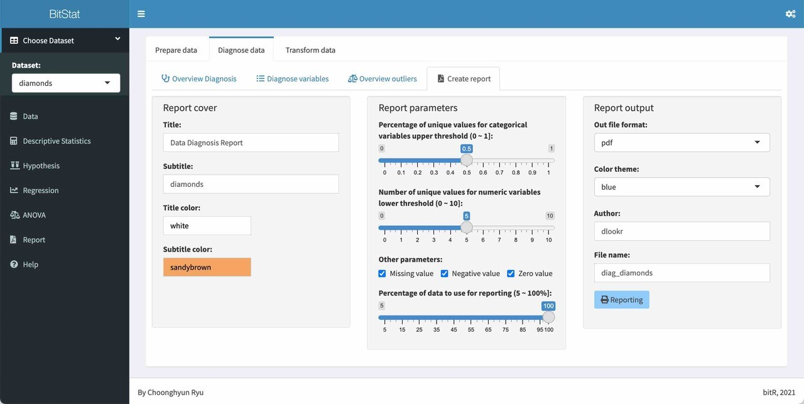
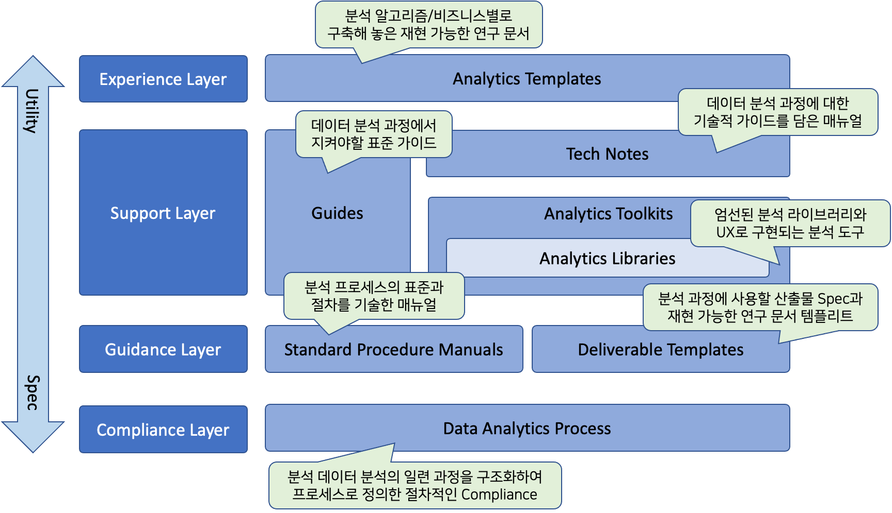
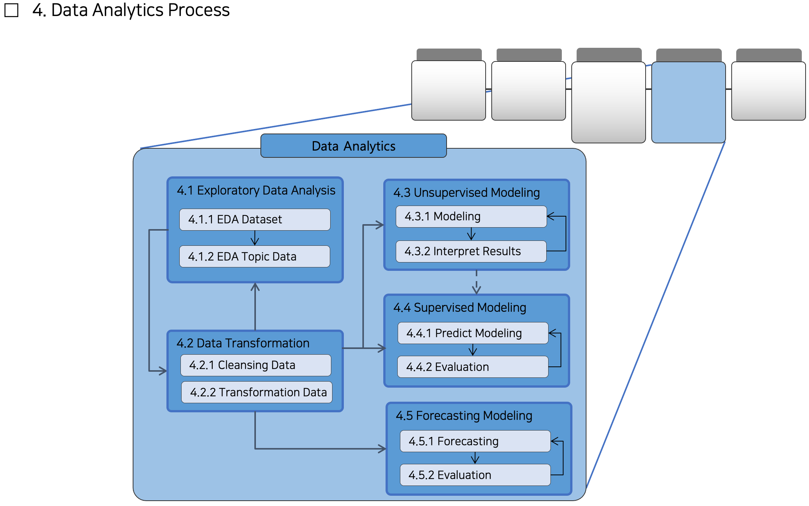

```{r setup, include = FALSE}
library(tidyverse)

xaringanExtra::use_panelset()

options(
  htmltools.dir.version = FALSE, 
  htmltools.preserve.raw = FALSE,
  tibble.width = 60, tibble.print_min = 6,
  crayon.enabled = TRUE
)

knitr::opts_chunk$set(echo = FALSE, message=FALSE, warning=FALSE,
                      comment="", digits = 3, tidy = FALSE, prompt = FALSE, fig.align = 'center',
                      fig.width = 7.252,
                      fig.height = 4,
                      dpi = 300)

# uncomment the following lines if you want to use the NHS-R theme colours by default
# scale_fill_continuous <- partial(scale_fill_nhs, discrete = FALSE)
# scale_fill_discrete <- partial(scale_fill_nhs, discrete = TRUE)
# scale_colour_continuous <- partial(scale_colour_nhs, discrete = FALSE)
# scale_colour_discrete <- partial(scale_colour_nhs, discrete = TRUE)

# https://stackoverflow.com/questions/64369722/getting-rmarkdown-to-print-improved-tibble-printing
colourise_chunk <- function(type) {
  function(x, options) {
    lines <- x
    if (type != "output") {
      lines <- crayon::red(lines)
    }
    paste0(
      '<div class="sourceCode"><pre class="sourceCode"><code class="sourceCode">',
      paste0(
        fansi::sgr_to_html(htmltools::htmlEscape(lines)),
        collapse = "\n"
      ),
      "</code></pre></div>"
    )
  }
}

knitr::knit_hooks$set(
  output = colourise_chunk("output"),
  message = colourise_chunk("message"),
  warning = colourise_chunk("warning"),
  error = colourise_chunk("error")
)
```


class: title-slide, left, bottom

# `r rmarkdown::metadata$title`
----
## **`r rmarkdown::metadata$subtitle`**
### `r rmarkdown::metadata$author`
#### (`r rmarkdown::metadata$institute`)
### `r rmarkdown::metadata$date`

 
---
class: inverse, middle
name: data-science-case

# 발표 개요

----

.pull-left[

한국에서 R 사용자를 위한 첫 컨퍼런스인, .orange[**'R User Conference 2011'**]이 성황리에 개최된 지 10년이 흘렀습니다. 강산이 변한다는 10년동안 국내외 데이터 분석 필드는 많은 변화와 발전을 이루었으며, 디지털 경제전환(Digital Transformation)의 가속화의 핵심에는 데이터와 데이터 분석 기술이 있다는 중론이 있습니다.

10년 전 컨퍼런스를 호스트한 R 사용자로서의 감회는, .orange[**데이터 분석 필드의 염원과 기대를 R의 대중화로 뿌리내리지 못한 것에 대한 아쉬움**]입니다. 다시 R 사용자의 염원을 담아서 .orange[**R에 대한 관심과 대중화를 위한 몇 가지 시도를 소개**]하면서, R 사용자의 관심을 요청합니다.

]
 
.pull-right[   
.left[

1\. [과거를 회상하며](#past)

2\. [미래를 설계하며](#future)

3\. [아카데미를 위한 R 환경 개선](#academy)

4\. [엔터프라이즈를 위한 R 환경 개선](#enterprise)

5\. [마무리](#close)

]
] <!--end of right-column-->


---
name: past
class: inverse, middle, center

# 과거를 회상하며

<!--------------------------  New Wind in Korea with GNU R ------------------------------------>

---
name: past-rconf
# New Wind in Korea with GNU R

.center[
  
]

* 10년 전에는 
  + 빅데이터 분석 도구로서의 R 활용에 대한 기대감 
  + SI, 인터넷, 통신, 게임업체 등 기업의 높은 관심도
  + Statistical Computing > Big Data > Visualization > Bioinformatics 니즈

* **.blue["New Wind in Korea with GNU R"]**
  + 제 1회 R User Conference 슬로건
  + Dr. Duncan, Dr. John Fox, Dr. Friedrich Leisch, Tal Galili

* 조기 마감, 210여명 오프라인 행사 참석
  + 컨퍼런스 공간의 한계로 선착순 수용
  
---
name: intro-survey
# 2011년도 컨퍼런스 설문지 분석

.center[
  
]

--

.blue[**R 대중화**]를 위한 .blue[**솔루션**]  은 .blue[**무엇이었던가?**]

--

- 진입 장벽을 낮출, 초보자를 위한 R 학습 인프라

--

- 일선 현장에서의 활용을 위한 지원 체계

--
 
- 엔터프라이즈 환경에서의 활용 사례 발굴

--

- R의 장점을 살린 킬러 컨텐츠
    
    
---
name: paradigm-field
# 데이터 분석 필드에서의 패러다임 전환

.center[
  
]

--

**python의 대중화와 R의 소외감**
- 공급부족 데이터 분석시장에 개발자 캐릭터 분석가의 진입 &#8594; 개발자 선호 툴
- CRM, 빅데이터, 거쳐 시장에서의 딥러닝의 붐업 &#8594; 딥러닝 python 라이브러리

--

**엔지니어링의 중요성 부각**
- 오픈소스 생태계의 여러 솔루션을 다룰 수 있는 멀티플레이어 요구


---
name: paradigm-r
# R 생태계의 패러다임 전환

.center[
  
]

--

**독립 시스템에서 에코 시스템으로 전환**
- base R을 넘어 Tidyverse, Tidymodels, ...

--

**재현가능 연구를 위한 생태계 완비**
- 데이터 분석 경험의 공유 및 핸즈온 교육 용이

--

**엔터프라이즈 시장에서의 활용 가능**
- 부족했던 R 성능의 캐치업 &#8594; 수행속도, 데이터 핸들링 용량 등
     
      
---
name: future
class: inverse, middle, center

# 미래를 설계하며


---
name: rconf
# Again Wind in Korea with GNU R

.center[
  
]
    
--

- .blue[**"Again Wind in Korea with GNU R"**]

--

- 10년 전처럼, 오늘 행사가 .blue[**R에 대한 기대감 염원**]에 불을 다시 지피기는 계기 

--

- 개별 세션들을 통해서 시청자들이 많은 경험을 습득하는 컨퍼런스가 되길 기대 

--

- 개인적으로는
  - 20여년 R 사용을 통해 꿈 꾸었던 빅 빅처를 소개하고,
  - 역동적인 한국의 R 생태계 조성을 위한 협력이 늘어나기를 기대


---
name: survey-1
# 다시 꺼낸 Survey - 진입장벽

.center[
  
]

* 아카데미, 공공기관, 중소기업의 R 진입 장벽은 무엇인가?
  + **새로운 언어를 배워야 한다는 부담감** 
  + 이미 익숙한 상용 데이터분석 소프트웨어를 사용함
      + 비용 절감 목적으로 접근하려는데, 취약한 R 교육훈련 인프라
      
* **.blue[오늘 이야기할 첫번째 주제]** - 발상의 전환
  + **.red["R이 아니라, R로 만들어진 데이터 분석 소프트웨어를 만들어 보자."]** 


---
name: survey-2
# 다시 꺼낸 Survey - 대중화의 걸림돌

.center[
  
]

* 엔터프라이즈의 R 진입 장벽은 무엇인가?
  + 대용량 분산 환경 니즈 &#8594; **대용량 데이터처리의 성능 구현 사례** 
  + 한글화 자료, 샘플, 매뉴얼의 니즈 &#8594; **한글화된 가이드 제공**  
  
* **.blue[오늘 이야기할 두번째 주제]** - 빅 픽쳐, 욕심 내보기
  + **.red["All-in-One R 데이터분석 방법론을 만들어 보자."]** 
      + CRISP-DM, SEMMA, Tidiverse 데이터과학 프로세스 접목


---
name: academy
class: inverse, middle, center

# 아카데미를 위한 R 환경 개선

---
name: intro-openstat
# 오픈소스 통계분석 시스템 개발 

.center[
  
]

* 오픈소스 통계분석 시스템이란?
  + .blue[**R/Shiny**]로 개발한 .blue[**오픈소스**] 기반의 R 패키지, 현재 **프로토타이핑** 중

* 아카데미, 중소기업, 공공기관, 일반인 대상  
  + 통계 비전공자들을 위한 데이터 분석 시스템 
  + R을 모르더라도 사용가능, R 사용자는 더욱 쉽게 활용 

* .blue[**기초통계**] 및 .blue[**머신러닝**] 분석 기능 제공


---
name: feature-openstat
# 오픈소스 통계분석 시스템 특징 

**다국어 지원(i18n)**
- .blue[**국문**]과 .blue[**영문**] 메뉴 및 메시지

.center[
  
    
]


---
name: why-openstat
# 왜 통계분석 시스템인가?

--

**뿌리깊은 나무는 바람에 아니 뮐세**
- 머신러닝, 딥 러링(AI)의 학문적 백드라운드인 통계학
- 데이터를 이해하고 인사이트를 발굴할 수 있는 보편적인 통계적 방법론 적용

--

**예쁘지만 만질 수 없는 그림 속의 장미꽃**
- 팬시한 딥러닝 사례는 만지만, 현실속에서 활용한 사례는 제한적
- 만질 수 있는 안개꽃이 현실적 (데이터 한계, 리소스 한계, 분석 목적에 부합하는 방법)

--

**대중을 위한 보편적인 기능에 충실하자**
- 엔터프라이즈 시장이 대상이 아닌 아카데미, 소규모 연구 및 분석 조직 타켓팅 
- Digital Transformation 시대에 소외된 계층 지원
- 파레토 법칙 &#8594; 80%는 통계적 방법론에 부합하고, 20%가 머신러닝/딥러닝이 필요?

--

**Win-Back을 기대하며**
- 오픈 통계분석 시스템 사용자가 R 사용자로 전향하는 사례 기대
- R은 목적이 아닌 수단이지만, 그래도 이왕이면 R 사용자


---
name: feature-openstat2
# 오픈소스 통계분석 시스템 특징 

**데이터 분석 보고서 지원** &#8594; .blue[**PDF 포맷 보고서**]와 .blue[**HTML 포맷 보고서**] 

.center[
  
    
]

**도움말 및 튜토리얼 지원** 

.center[
  
]


---
name: enterprise
class: inverse, middle, center

# 엔터프라이즈를 위한 R 환경 개선


---
name: largedata-needs
# 대용량 데이터 처리의 니즈

.center[
  
]

* CRAN Task Views
  + [High-Performance and Parallel Computing with R](https://cran.r-project.org/web/views/HighPerformanceComputing.html)

* 다건 처리의 진화, 당신의 위치는 어디인가요?
  + loop &#8594; apply &#8594; purrr &#8594; furrr

---
name: solution-furrr

# 대용량 데이터 처리를 위한 솔루션 - 예제

.panelset[
.panel[.panel-name[준비]

```{r prepare, echo=TRUE}
# 테스트용 데이터 생성
(distribution <- tibble::tibble(
  uniform = runif(4),
  normal = rnorm(4),
  student_t = rt(4, df = 3)
))

# 사용자 정의 함수
minmax <- function(x) {
  (x - min(x)) / diff(range(x))
}
```

]

.panel[.panel-name[for loop]

```{r loop-code, echo=TRUE, eval = TRUE}
distribution_minmax <- distribution

# 반복문 수행
for (nm in names(distribution)) {
  distribution_minmax[[nm]] <- minmax(distribution[[nm]])
}

distribution_minmax
```

]

.panel[.panel-name[apply 계열]

```{r apply-code, echo=TRUE, eval = TRUE}
# sapply() 수행
distribution_minmax <- sapply(distribution, minmax)

tibble::as_tibble(distribution_minmax)
```

]

.panel[.panel-name[purrr]

```{r purrr-code, echo=TRUE, eval = TRUE}
# functional program 수행
purrr::map_df(distribution, minmax)
```

]

.panel[.panel-name[furrr]

```{r furrr-code, echo=TRUE, eval = TRUE}
# functional program 수행
# RStudio에서는 sequential 수행 
options(future.globals.maxSize = 5 * 1024 ^ 2) # 메모리 부족 에러 시 사용 
no_cores <- future::availableCores() - 1
future::plan("future::multicore", workers = no_cores)

furrr::future_map_dfr(distribution, minmax)
```

]

]


---
name: exam-furrr

# 대용량 데이터 처리를 위한 솔루션 - 사례

* 수십 GB JSON 파일을 tibble 객체로 불러오는 사례

```{r exam-furrr, echo=TRUE, eval=FALSE}
parsing_log <- seq(nrow(ga_record)) %>%
  future_map_dfr(function(x) {
    sucess <- TRUE
    msg <- "OK"

    result <- try(ga_record[x, ] %>%
      pull %>%
      fromJSON)

    if (class(result) == "try-error") {
      msg <- result

      result <- list("error")
      sucess <- FALSE
    }

    tibble(result = list(result), sucess = sucess, msg = msg)
  }, .progress = TRUE)
```


---
name: intro-rdam
# R Data Analytics Methodology

.center[
  
]

* RDAM(R Data Analytics Methodology)
  + RDAM은 .blue[**데이터 분석의 절차 및 방법의 표준을 제시**]하고, .blue[**분석의 생산성과 품질 향상**]을 위한 여러 콤포넌트로 구성된 .blue[**R 기반의 데이터분석 방법론 Eco System**]
* RDAM 목적
  + .blue[**분석가의 경험과 무관하게, 만족할 수준 이상의 분석 결과를 얻을 수 있도록 조력**]
* RDAM 구성
  + 4개 layers와 8개의 components로 구성되며, 각각의 layers와 components는 상호 유기적으로 결합되어 운용

---
name: rdam-component
# RDAM 컴포넌트 목록

.center[
  
]

* 오늘 소개할 컴포넌트
  + Data Analytics Process
      + 데이터 분석 과정을 구조화하여 프로세스로 정의한 절차적 Compliance
  + Standard Procedure Manuals    
      + Data Analytics Process 개별 과정의 표준과 절차
  + Guides   
      + 데이터 분석 과정에서 수행하는 특정 작업의 표준을 위해 제정한 지침
  + Analytics Library / Toolkit  
      + 데이터 분석을 위한 R 패키지 
      + 라이브러리를 자동화하거나 UX로 구성한 분석 자동화 툴
  + Tech Notes 
      + 데이터 분석 기법과 활용을 기술적으로 집대성한 R 테크니컬 가이드        
  
  
---
name: rdam-process
# Data Analytics Process

- 데이터 분석 과정을 구조화하여 프로세스로 정의한 절차적 Compliance

--

.pull-left[
  
.caption[
.grey[.small[R for Data Science 분석 프로세스]]
]
]

--

.pull-right[
  
.caption[
.grey[.small[RDAM에 분석 프로세스의 구조]]
]  
]

--

- RDAM에서는 데이터 분석 수행 단계분만 아니라,
  - 데이터 분석 프로젝트를 셋업하고, 
  - 분석 결과를 시스템에 적용(DataOps)하는 프로젝트를 마무리 등 전 과정 정의
  
- 5 Phases, 12 Activities, 23 Tasks  


---
name: rdam-process-detail
# Data Analytics Process

.pull-left[
  
.caption[
.grey[.small[Phase 레벨 프로세스]]
]
]


.pull-right[
  
.caption[
.grey[.small[Phase 레벨 프로세스 예시]]
]  
]


.pull-left[
  
.caption[
.grey[.small[Task 레벨 프로세스  예시]]
]
]


.pull-right[
  
.caption[
.grey[.small[프로세스 목록]]
]  
]


---
name: rdam-spm
# Standard Procedure Manuals

- Data Analytics Process 개별 과정의 표준과 절차를 정의한 .blue[**표준 및 절차 매뉴얼**]


.pull-left[
  
.caption[
.grey[.small[Project Initiation 스크린샷]]
]
]


.pull-right[
  
.caption[
.grey[.small[Data Acquisition 스크린샷]]
]  
]


- 5개 Phase별, 표준 및 절차 매뉴얼 개발

- bookdown으로 작성된 웹 문서로 배포하며, PDF 문서 파일로도 다운로드 가능함
  
  
---
name: rdam-guide
# Guides

- 데이터 분석 과정에서 수행하는 특정 작업의 .blue[**표준을 위해 제정한 지침**]

.center[
  
.caption[
.grey[.small[R 코딩 가이드 북 스크린 샷]]
]
]  
  
- 분석서버 운영 가이드
  - RStudio Server 운영 가이드
  - Shiny Server 운영 가이드    
- R 코딩 가이드
  - R 코딩 가이드북
  - R 코딩 템플리트
- 프로젝트 커뮤니케이션 가이드
  - Reproducible Research 이용한 분석결과 리뷰 템플리트 


---
name: rdam-lib
# Analytics Library / Toolkit

- 데이터 분석을 위해 엄선한 R 패키지와 .blue[**자동화하거나 UX로 구성한 자동화 툴**]

--
- dlookr (https://choonghyunryu.github.io/dlookr/)
  - support **Data Diagnosis**, **EDA**, **Data Transformation** Activity
  
- alookr (https://choonghyunryu.github.io/alookr/)
  - support **Supervised Modeling** Activity

--

- mlookr (미개발)
  - support **Plan Deployment** Activity

--

.center[
  
   
]  


---
name: rdam-lib2
# dlookr / alookr

.pull-left[
.large[**dlookr**]

- 데이터 품질 진단
- 탐색적 데이터 분석
- 변수변환, 결측치 및 이상치 처리
- 자동화된 보고서 3종
  - 웹 보고서, PDF 보고서
- data.frame, DBMS의 테이블 지원  

    
.caption[
.grey[.small[dlookr 스크린샷]]
]
]


.pull-right[
.large[**alookr**]

- 모델용 데이터 분할 및 정제
- 대표 이진분류 모델 자동 적합
- 모델 성능 평가 및 최적 모델 선택
- 이진 분류 전 과정 지원
  - auto-ML 
- h2o 및 python 모델 수용 계획  

  
.caption[
.grey[.small[alookr 스크린샷]]
]  
]


---
name: rdam-tech
# Tech Notes

- 데이터 분석 기법과 활용을 기술적으로 집대성한 .blue[**R 테크니컬 가이드**]


.pull-left[
  
.caption[
.grey[.small[Exploratory Data Analysis 스크린샷]]
]  
]

.pull-right[
  
.caption[
.grey[.small[Supervised Modeling 스크린샷]]
]
]

- 7개 Activity별 테크니컬 노트 개발

- bookdown으로 작성된 웹 문서로 배포하며, PDF 문서 파일로도 다운로드 가능함

- 앞에서 다룬 R에서의 대용량 데이터 핸들링 방법 등이 테크니컬 노트에 수록  


---
name: close

# 마무리

- 한국 R 생태계의 활성화 기대
  - 오픈 통계 분석기의 대중화 
  - R 데이터 분석 방법론의 데이터 분석 현장에서의 활용

- 후속 세션을 통해서 R 관련 많은 정보를 얻고, 현장에서 적용하기를 바람


---
name: rconf-goodbye
class: middle, inverse

.pull-left[
# **경청해 주셔서 <br>감사합니다.**
<br/>

## 유충현
### Tidyverse Korea
### choonghyun.ryu@gmail.com

]

.pull-right[
.left[


]
]
